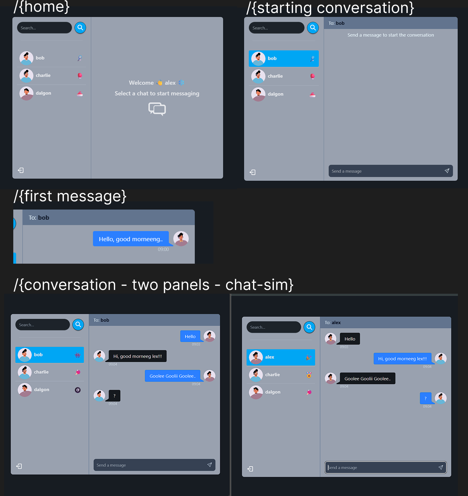

# Chat App

## Overview

**Chat App** is a real-time chat application that enables instant messaging between users with live updates.

## Features

### ✅ Current Features:
- CRUD operations for user management
- Realtime chat functionality using WebSockets
- Notification sound for new messages

## Installation

To get started with the **Chat App**, follow these steps:

1. **Clone the repository:**

    ```bash
    git clone https://github.com/muhammadderic/mern_realtime_chat_app.git
    cd mern_realtime_chat_app
    ```

2. **Install dependencies:**

    ```bash
    npm install
    ```

3. **Run the development server:**

    ```bash
    npm run dev
    ```

    Run [http://localhost:5000](http://localhost:5000) to start server, then visit [http://localhost:3000](http://localhost:3000) to see the pages.

## Screenshots

<div style="display: flex; justify-content: space-between;">
    
</div>

*Real-time chat interface showing conversation between users*

## Technologies Used

- **MERN Stack** – MongoDB, Express.js, React, and Node.js for full-stack development
- **Socket.io** – Enables real-time, bidirectional communication between web clients and servers

## Contributing

Contributions are welcome! If you'd like to contribute to this project, please follow these steps:

1. Fork the repository.
2. Create a new branch for your feature or bugfix.
3. Commit your changes and push your branch.
4. Open a pull request to have your changes reviewed.

## License

This project is licensed under the MIT License. See the [LICENSE](LICENSE) file for more details.

## Contact

If you have any questions or suggestions, feel free to reach out:

- **GitHub**: [muhammadderic](https://github.com/muhammadderic)